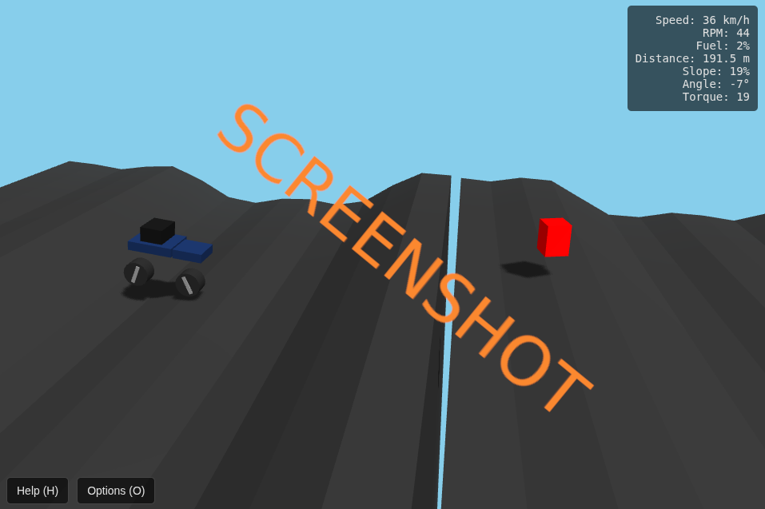

# js_climbhill_redux

# 🚙 Planck Racer 2.5D

**Planck Racer 2.5D** is a physics‑based hill‑racing game built with
**Three.js** for 2.5D rendering and **Planck.js** for high‑frequency
physics simulation.

This project features procedural terrain, real‑time vehicle suspension,
checkpoints, fuel pickups, dynamic shadows, mobile controls, and a full
in‑game HUD.

## Play it now: https://pemmyz.github.io/js_climbhill_redux/

------------------------------------------------------------------------

## Screenshots

## ✨ Features
a
-   **Three.js rendering**
    -   Dynamic shadows
    -   Fog & sky color
    -   Procedural ground extrusion
-   **Planck.js physics**
    -   120Hz physics simulation
    -   Realistic suspension
    -   Motor torque, braking, air rotation
-   **Procedural terrain**
    -   Infinite generation
    -   Slope clamping
    -   Automatic culling of far terrain
-   **Checkpoints & pickups**
    -   Fuel canisters
    -   Checkpoint system with respawn
-   **Cross‑platform controls**
    -   Keyboard (PC)
    -   Touch UI (Mobile & tablets)
-   **HUD metrics**
    -   Speed
    -   RPM
    -   Fuel
    -   Distance
    -   Slope percentage
    -   Vehicle angle
    -   Engine torque

------------------------------------------------------------------------

## 🎮 Controls

### **Keyboard**

  Action        Key
  ------------- -------
  Throttle      ↑
  Brake         ↓
  Pitch (Air)   ← / →
  Reset         R
  Pause         Space
  Toggle Help   H
  Debug View    D

### **Mobile**

  Action   Button
  -------- -----------
  Gas      **Gas**
  Brake    **Brake**
  Tilt     ◄ / ►

------------------------------------------------------------------------

## 📁 Project Structure

    index.html      – Main game UI + canvas
    style.css       – HUD + mobile controls + overlay panels
    script.js       – Game logic (physics, terrain, vehicle, input)

------------------------------------------------------------------------

## 🚀 Running the Game

1.  Place all project files in the same folder:
    -   `index.html`
    -   `style.css`
    -   `script.js`
2.  Open **index.html** in any modern browser (Chrome, Firefox, Edge).
3.  No server required --- everything runs client‑side.

------------------------------------------------------------------------

## 🛠 Libraries Used

-   **Three.js**\
    CDN:
    `https://cdnjs.cloudflare.com/ajax/libs/three.js/r128/three.min.js`

-   **Planck.js**\
    CDN: `https://cdn.jsdelivr.net/npm/planck@latest/dist/planck.min.js`

Both are loaded directly from CDN in `index.html`.

------------------------------------------------------------------------

## 💡 Tips

-   If you crash or run out of fuel, press **R** to respawn.\
-   The vehicle handles differently in the air --- pitch at the right
    moment to land smoothly.\
-   Terrain becomes more varied the farther you travel.

------------------------------------------------------------------------

## 📜 License

MIT License

------------------------------------------------------------------------
